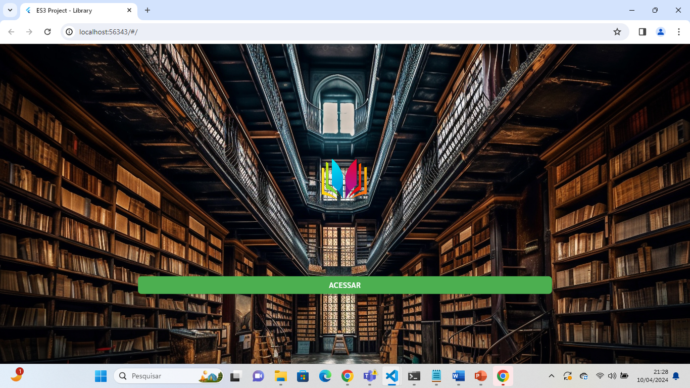
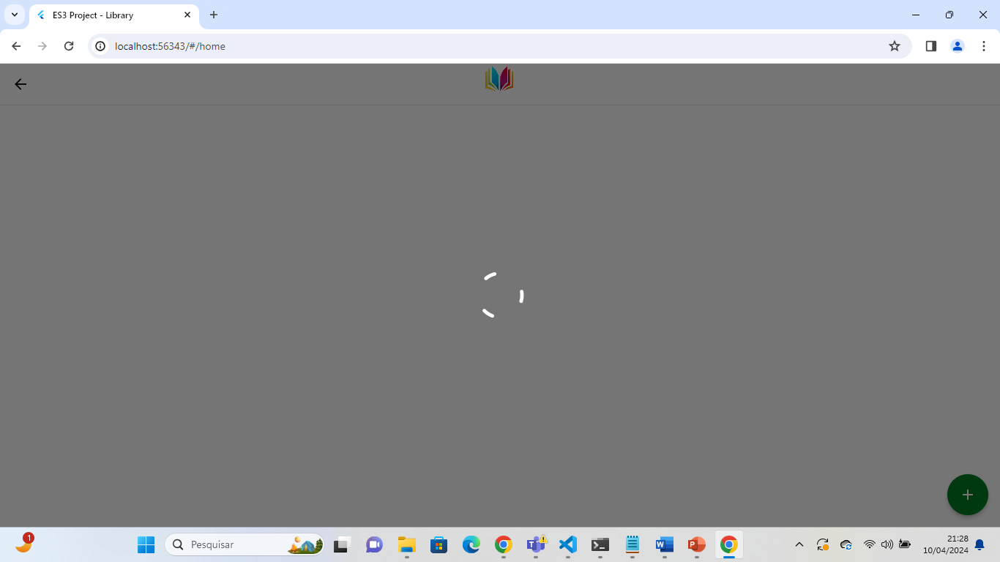
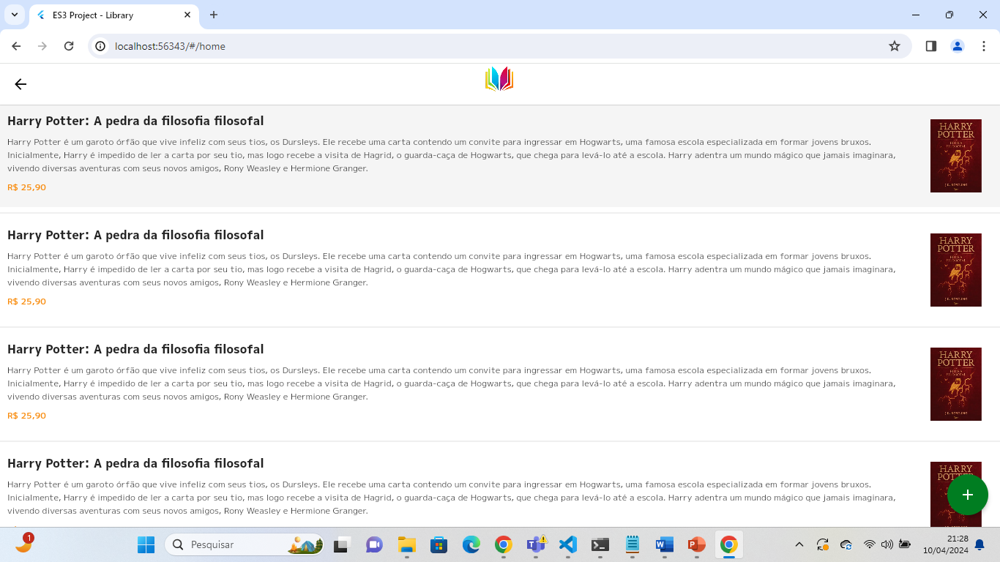
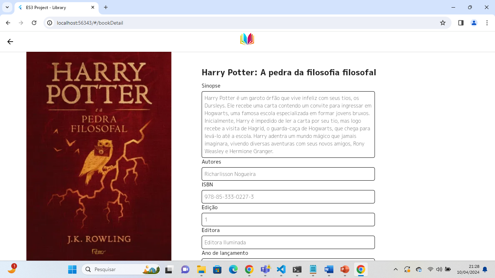
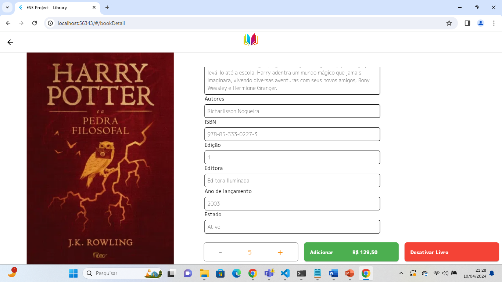
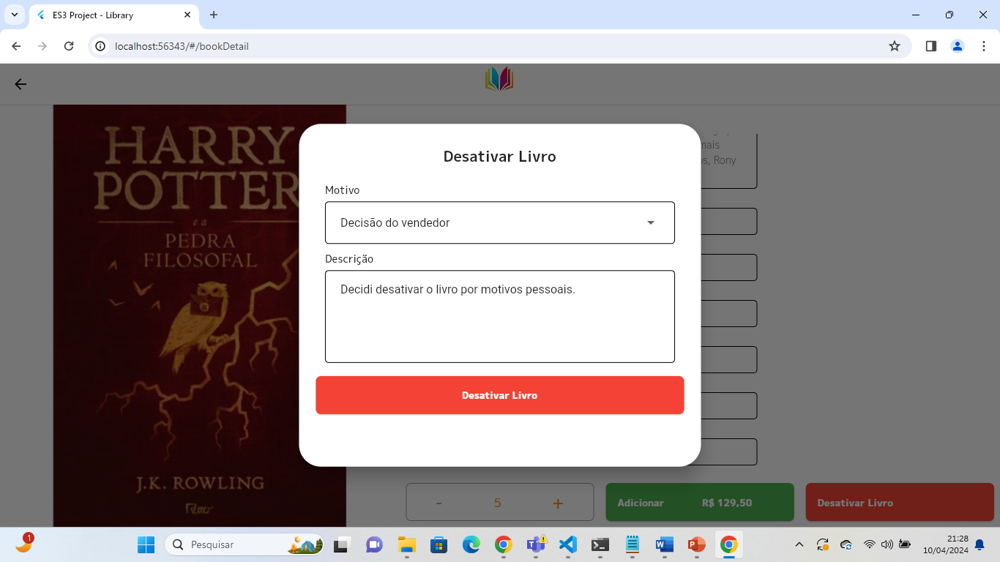
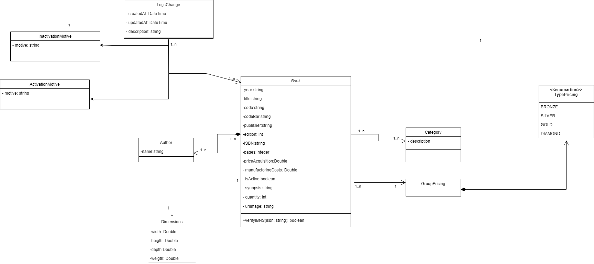

<center><h1> Projeto Flutter Web para a disciplina de Engenharia de Software 3 - Fatec de Mogi das Cruzes</h1></center>

## Aluno
```
Nome: Miguel Estevão Brasil Yañez Marques
RA: 1840482212029
```

## Requisitos

Certifique-se de ter o Flutter instalado em sua máquina. Você pode encontrar as instruções de instalação [aqui](https://flutter.dev/docs/get-started/install).

## Como Rodar

1. Clone este repositório para o seu ambiente local:

```bash
git clone git@github.com:miguelmarques1/es3_project_frontend.git
```

2. Acesse a pasta do projeto:

```bash
cd es3_project_frontend
```

3. Rode o comando para instalar todas as dependências e rodar o projeto no Google Chrome:

```bash
flutter run -d chrome
```

## Telas da aplicação

### Splash Page da aplicação
Tela apenas para apresentação inicial da aplicação.

### Tela de carregamento

### Home Page da aplicação
Tela onde serão apresentados os livros.

### Tela do Livro
Tela onde aparecem os atributos do livro e dá a possibilidade de adicionar o livro ao carrinho e inativá-lo.

### Tela do Livro - Botões

### Tela do Livro - Botões (Ação)

### Tela do Livro - Modal de inativação do livro
Nesta tela, é possível inativar o livro, dando um motivo e uma descrição.


## Diagrama de Classes do Projeto
